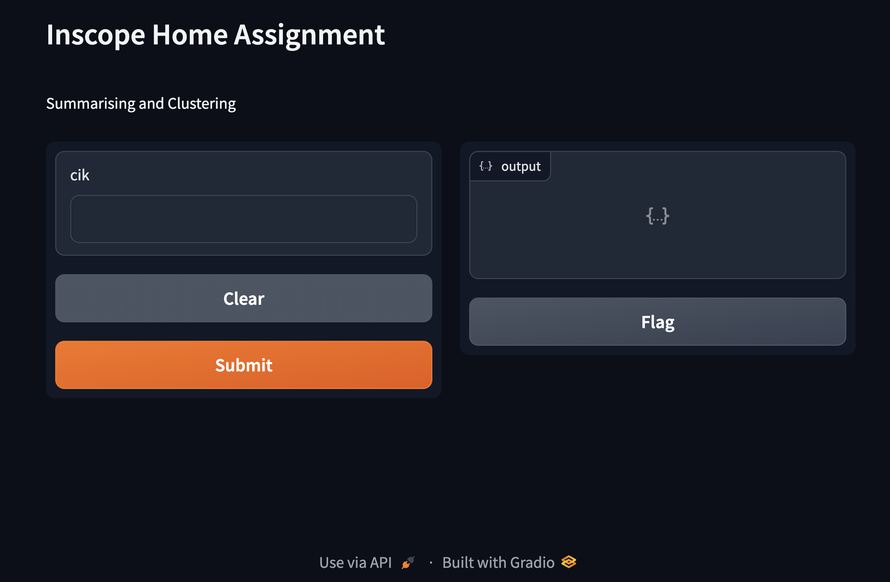
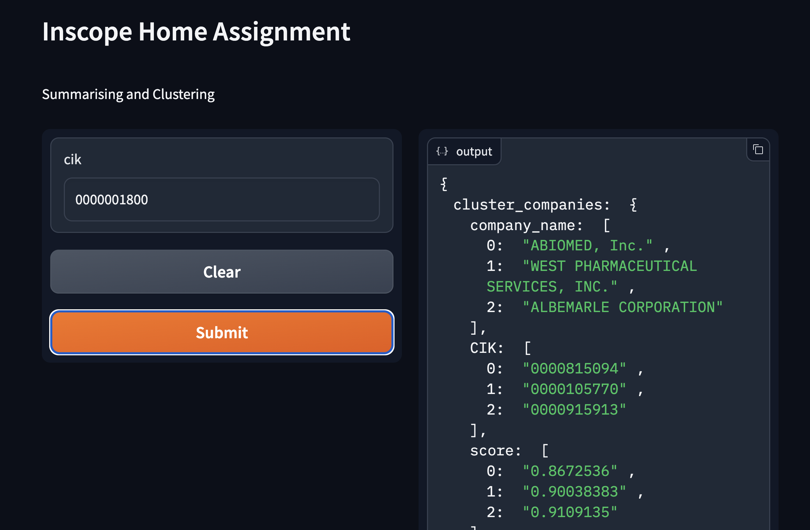

In this assignment you will build a prototype of a cluster analysis tool to navigate financial statements.

  

Each company has a unique CIK (Central Index Key) that is used to identify it in the data. The CIK is a 10 digit number, and is the prefix of the file name for each company's 10-K report.

  

There are three main tasks in this assignment:

* To construct a CIK -> Company Name mapping from the provided data.

* To summarize each company's report into a few sentences.

* To cluster the companies into similar groups based on their financial statements.

  

The goal of this assignment is to demonstrate your ability to build a data pipeline to process unstructured data, and to use that data to build a simple clustering and summarizing tool whose output could be built into a more complex application. What we expect you to build are proofs of concept, and not production-ready models.

  

If you decide to use a paid API to solve the exercise, we will reimburse you for usage up to $10.

  

## Instructions

1. Clone (**please, don't fork!**) this repository and create a new branch for your development work

1. Create your implementation following the [Specification](#specification) below

1. Add instructions on how to run your implementation to the [Getting Started](#getting-started) section.

1. In the [follow-up questions](#follow-up-questions) section below, respond inline to each of the questions.

1. Commit your implementation and answers to a new repo in your personal GH and give `@avyfain` access to the repo.

  

**Guidelines:**

- Do not spend longer than four hours on your implementation, a perfect implementation is not required or expected. Please move on to the [follow-up questions](#follow-up-questions) after that.

- You may use any language or tools you like to complete this assignment. You can use any libraries or frameworks you like, including any existing clustering libraries. You can use any pre-trained language models you like.

- Ask questions if you have them. The business problem is intentionally vague, so you will need to make some assumptions. Document your assumptions in your code and in the follow-up questions.

- It's fine to use Google or StackOverflow to look up syntax or documentation. If you use ChatGPT or similar tools, please share the prompts you used in the follow-up questions.

  

## Exercise Data

  

You can find a zip file with the required data in [this HuggingFace repo](https://huggingface.co/datasets/inscopehq/SEC-10K).

  

In the provided data zip file, you will find over 3000+ recent 10-K reports from publicly traded companies. These reports are HTML containing the financial statements for each company.

  

If you have a CIK, you can use it to access the corresponding company's data in the SEC's EDGAR database. For example, the CIK for Apple Inc. is 0000320193. You can find Apple's reports here: https://www.sec.gov/edgar/browse/?CIK=000320193.

  

We do not expect you to download any additional data from the SEC's database, but you can find the full documentation for the EDGAR database here: https://www.sec.gov/edgar/searchedgar/accessing-edgar-data.htm

  

## Specification

  

We expect you to build the following functionality:

- [ ] You will filter down the dataset to cluster companies that are in the S&P 500 index. You can find a recent list of CIKs for companies in the S&P 500 in the `SP500.txt` file.

- [ ] You will create a script that given a directory with report files can produce a `CIK -> Company Name` mapping in the shape of a CSV file with two columns: CIK and Company Name. Each row in this file will represent each file in the provided data. (hint: you don't need to throw an LLM at this problem)

- [ ] You will run your mapping script on the provided data, and include it in your response.

- [ ] You will write a data pipeline to process the provided HTML into an intermediate representation that can be used for clustering. One of the features in your intermediate representation should be a 1-paragraph summary of the report. You can use any pre-trained language model you like to generate the summary.

- [ ] You will use your pipeline to assign every company in the dataset into similar groups based on their financial statements.

- [ ] You will provide a Jupyter Notebook, a Streamlit app, or equivalent for users to inspect and interact with the results of your clustering and summarization. The visualization should allow the user to select a company and show other similar companies in the same cluster.

  
  

## Getting Started

Before you start, make sure you have the following installed:
- Python 3.8 or higher
- pip (Python package manager)
- Jupyter Notebook or JupyterLab


1. Clone the repository to your local machine.
```sh
git clone https://github.com/shubhankar1477/inscope-take-home-assignment.git
```
2. Navigate to the project's root directory.
```sh
cd inscope-takehome-ai
```
3. Inside the project directory, navigate to the scripts directory where the requirements.txt file is located.
```sh
cd scripts
```
4. Unzip data folder
   data folder was too big to commit if you can put data.zip folder from above folder to scripts folder would be great .
   folder link : (https://huggingface.co/datasets/inscopehq/SEC-10K)
```sh

unzip data.zip
```
5. Install the required Python packages using pip
```sh
pip install -r requirements.txt
```
6. Once the dependencies are installed, you can run the main.py file to get the results from the inference api
```sh
python main.py
```

#### Inference api 

  

With the server running, you can hit the API endpoint to get similar companies. The faiss index is already created and has summaries indexed. Hence, Use the following curl command:

  
```sh
curl --location 'http://localhost:8000/api/v1/getSimilarCompanies' \

--header 'Content-Type: application/json' \

--data '{

"companyCik":"0000105770"

}'
```
  
  #### Data pipeline to index into vector db
To prepare the data for the vector database, start by running the `train_summariser.ipynb` notebook located in the `scripts` directory. This Jupyter notebook reads HTML files from the `data` directory, generates summaries, and stores them into the vector database.
  
  #### Gradio in interface for simple app to showcase.
  
  

## Follow-Up Questions

  

**1. Describe which task you found most difficult in the implementation, and why.**

    1. **Summarizing Long Documents**: The complexity of accurately distilling and synthesizing essential information from lengthy documents into a coherent summary.
    
    2. **Selective Information Extraction**: The difficulty in deciding which domain-specific parts of the text should be input into the model.
    
    3. **Relevance Identification**: The challenge of sifting through extensive information in long documents to pinpoint and extract the most pertinent content for the summary.
    
    4. **Input Section Selection**: Identifying and obtaining the most relevant sections of the document for model input was a significant hurdle.
    
    5. **Memory Constraints**: Handling large documents often leads to memory constraints on local systems, making it difficult to process data efficiently.
    
    6. **Computational Load**: Managing the high computational load required to process and summarize large datasets, especially when dealing with complex models.
    
    7. **Balancing Accuracy and Efficiency**: Striking the right balance between the accuracy of the summarization and the computational efficiency, particularly when dealing with resource-intensive tasks.

**1. What led you to choose the libraries or frameworks you used in your implementation?**


    1. **Coding and Analysis Tools**: Utilized Python and Pandas for coding and data analysis tasks.
    
    2. **HTML Parsing**: Employed Beautiful Soup and regex for parsing HTML and extracting information from documents.
    
    3. **NLP Model Integration**: Used Huggingface and Sentence Transformer libraries for generating embeddings, known for their easy-to-use APIs for various NLP tasks.
    
    4. **Summary Generation**: Applied BART-large-cnn model specifically for generating summaries.
    
    5. **Choice of BART Model**: Selected BART due to its Seq2Seq architecture, which is versatile in handling diverse content in financial reports, and its training on various writing styles and subjects.
    
    6. **Data Storage and Semantic Search**: Implemented langchain and Vector database for efficient storage of summaries and to leverage semantic search capabilities for finding similar companies.
    
    7. **API Development**: Chose FastAPI for creating the API endpoint, due to its popularity, support for concurrency, high performance, and ease of use.

1. **How did you evaluate whether the clusters and summaries created by your system were good or not?**

        1. **ROUGE Score Assessment**: Utilized the ROUGE score to evaluate the quality of the summaries by comparing them with reference summaries.
        
        2. **Human Assessment for Summaries**: human evaluations to assess the coherence, relevance, and overall quality of the summaries generated by the system.
        
        3. **Similarity Score for Clusters**: Applied similarity scoring to evaluate how well the clustering algorithm grouped similar items, ensuring that each cluster is meaningfully composed.
        
        4. **Emphasis on Human Assessment**: Personal belief that human assessment is the most effective metric for evaluating both the quality of summaries and the efficacy of clustering.
    
    

1. **If there were no time or budget restrictions for this exercise, what improvements would you make in the following areas:**

- Implementation

- User Experience

- Data Quality 


      1. **Enhance Open Source Summary Model**: Focus on experimentation and improvements in open-source models for more efficient summary generation.
      2. **Advanced Data Cleaning Techniques**: Implement better data cleaning and preprocessing strategies to enhance the quality of input data.
      3. **Financial Report Analysis**: Deep dive into financial reports to extract key information and improve summary generation accuracy.
      4. **Enhanced User Interface**: Develop a user-friendly interface displaying comprehensive company data, including share prices and latest news.
      5. **Graphical Representation of Share Prices**: Introduce features to visually compare the user-selected company with its competitors in the market.
      6. **Incorporate ROUGE Evaluation Metric**: Adopt the ROUGE score for summary quality assessment, using a set of reference summaries for calibration.
      7. **User Feedback Integration**: Create a feedback loop allowing users to rate generated summaries and company profiles, enhancing future outputs.
      8. **Refinement of Company Clustering and Human Input**: Offer options for users to adjust company clustering and provide input, ensuring more relevant and accurate results.
      9. **Model Fine-Tuning Through Transfer Learning**: Leverage transfer learning techniques to fine-tune the model for specific needs and higher accuracy. 


**Q : If you built this using classic ML models, how would approach it if you had to build it with LLMs? Similarly, if you used LLMs, what are some things you would try if you had to build it with classic ML models?**

    1. **Vectorization**: Transform text into numerical vectors using models like TF-IDF or Word Embeddings (e.g., GloVe).
    
    2. **Textual Clustering**: Employ Hierarchical, Agglomerative, or DBSCAN clustering algorithms to group companies based on textual similarity.
    
    3. **Financial Metrics Extraction**: Extract crucial financial metrics such as revenue, profit margin, and debt-to-equity ratio from company reports.
    
    4. **Normalization of Metrics**: Standardize these metrics for comparability across different companies.
    
    5. **Financial Clustering Approach**: Utilize Principal Component Analysis (PCA) for dimensionality reduction, followed by a clustering algorithm to categorize companies based on financial health and performance.
    
    6. **Integration with LLMs**: If using Large Language Models (LLMs), leverage their advanced natural language understanding capabilities for more nuanced text interpretation and context-aware metric extraction.
    
    7. **Transfer Learning for Classic ML**: When shifting from LLMs to classic ML, consider using transfer learning techniques to leverage pre-trained models for initial feature extraction.
    
    8. **Semantic Analysis with Classic ML**: Implement advanced NLP techniques like Latent Semantic Analysis (LSA) to capture deeper textual meanings in classic ML models, compensating for the contextual understanding provided by LLMs.
    
    9. **Incorporate External Data Sources**: Enrich the analysis by integrating external data sources like market trends or industry reports, which can provide additional context for both LLM and classic ML approaches.
    
    10. **Hybrid Model Exploration**: Explore hybrid models combining LLMs' language processing strengths with the structured analytical capabilities of classic ML, particularly in handling financial data.


**5. If you had to build this as part of a production system, providing an inference API for previously unseen reports, how would you do it? What would you change in your implementation?**a

    1. **Existing Implementation**: The current implementation is capable of handling previously unseen reports.
    
    2. **In-House Vector Database**: For enhanced efficiency and control, it is advisable to establish an in-house vector database. This would facilitate better management and faster retrieval of text vectors.
    
    3. **Cloud Storage Integration**: Utilize services like Amazon S3 or other cloud storage solutions to store and access data. This approach ensures scalability and accessibility.
    
    4. **Dockerization for Deployment**: Implement Docker containers for deploying the application. This ensures consistency across different environments and simplifies deployment processes, whether on cloud instances or serverless APIs.
    
    5. **API Design and Documentation**: Develop a robust API with clear documentation. This includes defining endpoints for data submission and retrieval, and detailing request/response formats.
    
    6. **Scalability Considerations**: Optimize the system for scalability to handle varying loads. This might involve using load balancers and ensuring the system can scale up or down based on demand.
    
    7. **Security Measures**: Implement robust security measures to protect sensitive data. This includes secure data transmission protocols, authentication for API access, and data encryption.
    
    8. **Monitoring and Logging**: Set up comprehensive monitoring and logging mechanisms to track system performance, usage statistics, and to quickly identify and troubleshoot issues.
    
    9. **Continuous Integration/Continuous Deployment (CI/CD) Pipeline**: Establish a CI/CD pipeline for streamlined testing and deployment of updates and new features.

    10. **User Feedback Loop**: Create a mechanism for collecting user feedback on the system's performance and accuracy, which can be used to continuously improve the model and system as a whole.
  

# Evaluation Criteria

  

You will be evaluated out of a total of 50 points based on the following criteria.

  

- Learning Exercise (30 points total)

-  **Functionality (20 points)**: is the requested functionality implemented as described?

-  **Code Quality (10 points)**: is the code well structured and easily read?

-  **Bonus (3 maximum)**: bonus points are awarded for anything that goes above and beyond the items in the specification. For example, additional .

- Follow Up Questions (20 points total)

- Question 1 (2 points)

- Question 2 (2 points)

- Question 3 (3 points)

- Question 4 (3 points)

- Question 5 (5 points)

- Question 6 (5 points)


## Gradio Interface :
  - Gradio Link : https://17d65fc27913823ec5.gradio.live
  
  - Input Snapshot
  - 
  - Output Snapshot
  - 
  
  - **PS** :
    - When the link takes a nap and refuses to work, just tap into my telepathic screenshot-sharing abilities, and we'll have a discussion about it during our cosmic call-back!
